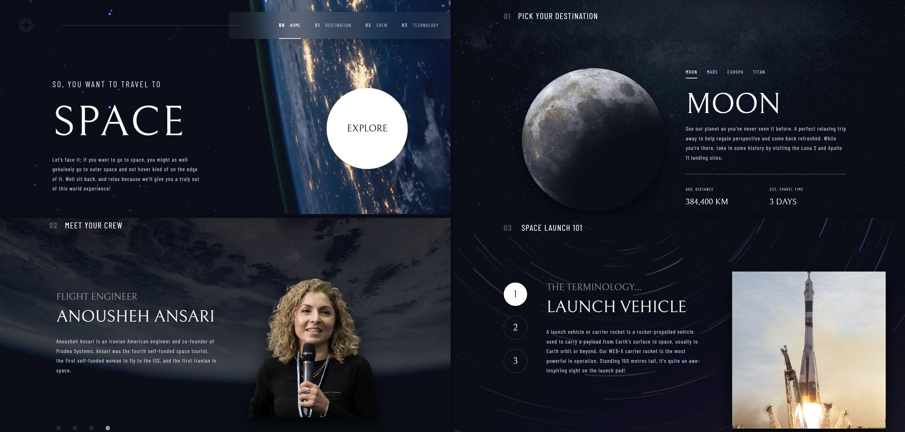
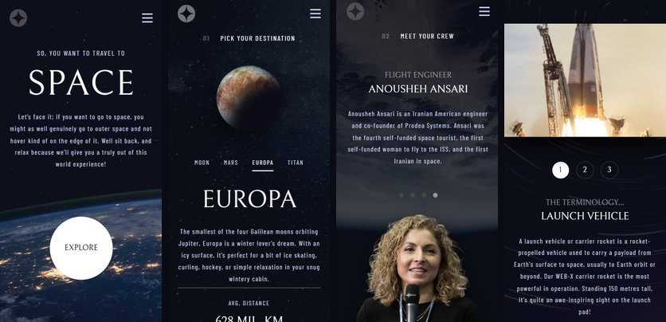

 # 🚀 Space Tourism — Multi-page Website

An animated, multi-page space tourism website built with **React**, **React Router**, **Tailwind CSS**, and **GSAP**. It reimagines the classic [Frontend Mentor "Space tourism website" challenge](https://www.frontendmentor.io/challenges/space-tourism-multipage-website-gRWj1URZ3) as a fully animated single-page-app experience — complete with a custom rocket-launch loading screen, swipe-based navigation, and direction-aware page transitions.

**🔗 Live Demo:** **[mojtaba-mehrzad.github.io/Space-tourism-multi-page-website](https://mojtaba-mehrzad.github.io/Space-tourism-multi-page-website/)**



<p align="center">
  
</p>

## Table of contents

- [Overview](#overview)
  - [The challenge](#the-challenge)
  - [Screenshots](#screenshots)
- [Features](#features)
- [Tech stack](#tech-stack)
- [Project structure](#project-structure)
- [Getting started](#getting-started)
  - [Prerequisites](#prerequisites)
  - [Installation](#installation)
  - [Available scripts](#available-scripts)
- [Deployment](#deployment)
- [What I focused on](#what-i-focused-on)
- [AI collaboration](#ai-collaboration)
- [Author](#author)
- [Acknowledgments](#acknowledgments)
- [License](#license)

## Overview

### The challenge

Users should be able to:

- View the optimal layout for each page depending on their device's screen size (mobile, tablet, and desktop)
- See hover and active states for every interactive element
- Navigate between **Home**, **Destination**, **Crew**, and **Technology** pages and toggle between tabs to reveal new content
- Swipe left/right on touch devices (or drag with a mouse) to move between destinations, crew members, and technologies — with animations that follow the direction of the gesture

### Screenshots


*Clockwise from top-left: Home, Destination, Technology, Crew — all captured from the [live site](https://mojtaba-mehrzad.github.io/Space-tourism-multi-page-website/).*

<p align="center">
  
</p>
<p align="center"><em>Mobile layouts, left to right: Home, Destination, Crew, Technology.</em></p>

> Static screenshots don't do the animations justice — the loading screen, scramble-text reveals, and swipe transitions are best seen live.

## Features

- 🛰️ **Custom animated loading screen** — a rocket drifts weightlessly while assets preload, then launches into a warp-speed star field perfectly synced to the rocket's own acceleration curve, before handing off to the app.
- 🌍 **Four fully responsive pages** — Home, Destination, Crew, and Technology, each with a bespoke mobile/tablet/desktop layout.
- ✋ **Swipe & drag navigation** — swipe on mobile or click-and-drag on desktop to cycle through destinations, crew members, and technologies; keyboard/tab clicks stay perfectly in sync with swipe direction.
- 🎬 **Direction-aware GSAP animations** — content slides in from the side that matches the direction you navigated, tying gesture and animation together.
- ✨ **Rich micro-interactions** — scramble-text reveals, line-masked text transitions, staggered entrances, and a pulsing "Explore" button, all powered by GSAP (`ScrambleTextPlugin`, `SplitText`, `useGSAP`).
- 🖼️ **Responsive art direction** — `<picture>`/`srcSet` is used throughout so the right image (and format) loads for each breakpoint.
- ⚡ **Optimized asset preloading** — every background, destination, crew, and technology image is preloaded (with the exact hashed URLs Vite generates at build time) before the site is revealed, avoiding late pop-in or flashes of unstyled backgrounds.
- 🧭 **Client-side routing** — powered by `react-router-dom`, deployed to GitHub Pages with the correct base path handling for both dev and production.

## Tech stack

- **[React 19](https://react.dev/)** — UI library
- **[React Router](https://reactrouter.com/)** — client-side routing
- **[Vite](https://vitejs.dev/)** — build tool & dev server
- **[Tailwind CSS 4](https://tailwindcss.com/)** — utility-first styling
- **[GSAP](https://gsap.com/)** (`@gsap/react`, `ScrambleTextPlugin`, `SplitText`, `ScrollTrigger`, `DrawSVGPlugin`) — animation engine
- **[ESLint](https://eslint.org/)** — linting
- **[gh-pages](https://www.npmjs.com/package/gh-pages)** — deployment to GitHub Pages

## Project structure

```
src/
├── animations/        # Standalone GSAP animation functions, one concern per file
├── assets/             # Fonts, backgrounds, and shared icons bundled by Vite
├── components/
│   ├── layout/         # App shell: RootLayout, Navbar, LoadingScreen, Split
│   └── ui/              # Reusable presentational components (Tabs, Image, PageHeader)
├── config/             # Per-page Tailwind class presets for the Tabs component
├── datas/              # Static content (destinations/crew/technology copy) + nav links
├── pages/              # One folder per route, each with its own sections/ subfolder
├── styles/             # Shared background utility classes
└── utils/              # Custom hooks & helpers (useGsap, useSwipeableItem, preloadImages...)
```

Each page (`Home`, `Destination`, `Crew`, `Technology`) follows the same pattern: a top-level route component wires up data, refs, and animations, and delegates markup to small `sections/*.jsx` components — keeping pages declarative and easy to scan.

## Getting started

### Prerequisites

- [Node.js](https://nodejs.org/) 18+ and npm

### Installation

```bash
# Clone the repository
git clone https://github.com/mojtaba-mehrzad/Space-tourism-multi-page-website.git
cd Space-tourism-multi-page-website

# Install dependencies
npm install

# Start the dev server
npm run dev
```

The app will be available at `http://localhost:5173`.

### Available scripts

| Script | Description |
| --- | --- |
| `npm run dev` | Start the Vite dev server with HMR |
| `npm run build` | Type-check-free production build (outputs to `dist/`) |
| `npm run preview` | Preview the production build locally |
| `npm run lint` | Run ESLint across the project |
| `npm run deploy` | Build and publish `dist/` to GitHub Pages (`gh-pages`) |

## Deployment

The site is deployed to **GitHub Pages** at [mojtaba-mehrzad.github.io/Space-tourism-multi-page-website](https://mojtaba-mehrzad.github.io/Space-tourism-multi-page-website/). The Vite `base` path and the React Router `basename` are both switched automatically depending on the run mode (development vs. production), so the app works identically under `/` locally and under `/Space-tourism-multi-page-website/` in production.

## What I focused on

- **Motion with intent** — rather than decorative animation, every transition is tied to something meaningful: the rocket's real acceleration drives the star streak effect on the loading screen, and swipe direction drives which side content animates in from.
- **Small, composable animation functions** — each animation lives in its own file under `src/animations/` and is combined into per-page "master timelines," making it easy to reason about and reuse individual effects (e.g. `scrambleTextAnimation`, `textMaskingWrapper`, `risingUpAnimation`).
- **A shared `useSwipeableItem` hook** — the "swipeable list of items" pattern (selected item, index tracking, gesture direction, tab-click direction inference) used by the Destination, Crew, and Technology pages was extracted into a single reusable hook instead of being duplicated three times.
- **Correct asset preloading** — background images imported through Tailwind's `bg-[url()]` classes get fingerprinted/hashed by Vite at build time; the preloader imports those same assets directly so it always warms the cache for the *exact* URL the browser will request.


## Author

- **Mojtaba Mehrzad**
- Frontend Mentor — [@mojtaba-mehrzad](https://www.frontendmentor.io/profile/mojtaba-mehrzad)
- LinkedIn — [mojtaba-mehrzadian](https://www.linkedin.com/in/mojtaba-mehrzadian-b7972938a)
- GitHub — [@mojtaba-mehrzad](https://github.com/mojtaba-mehrzad)

## Acknowledgments

- Challenge and design by **[Frontend Mentor](https://www.frontendmentor.io/challenges/space-tourism-multipage-website-gRWj1URZ3)**.
- Astronaut photography and mission copy are part of the original Frontend Mentor challenge assets.

## License

This project is licensed under the [MIT License](./LICENSE).
